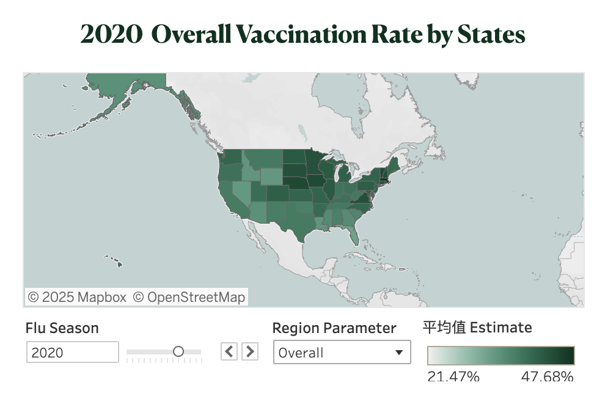
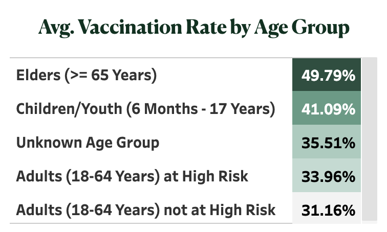
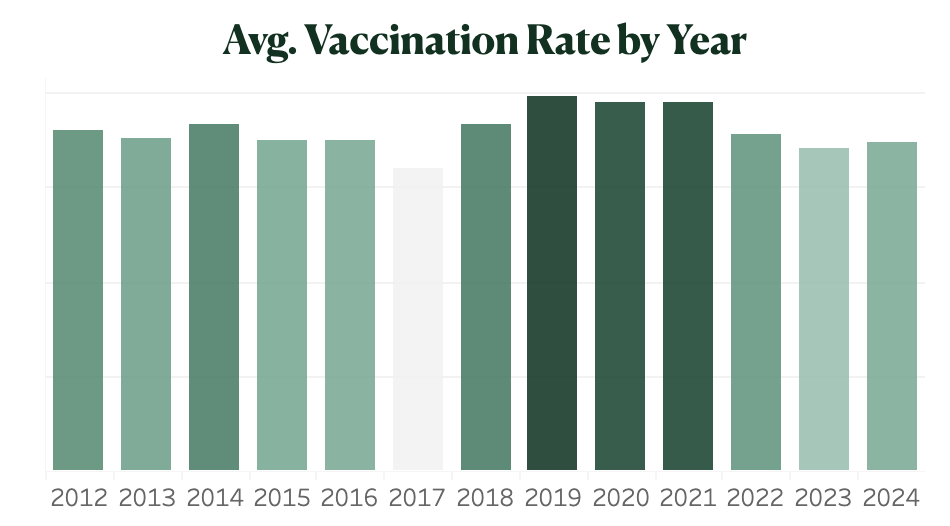
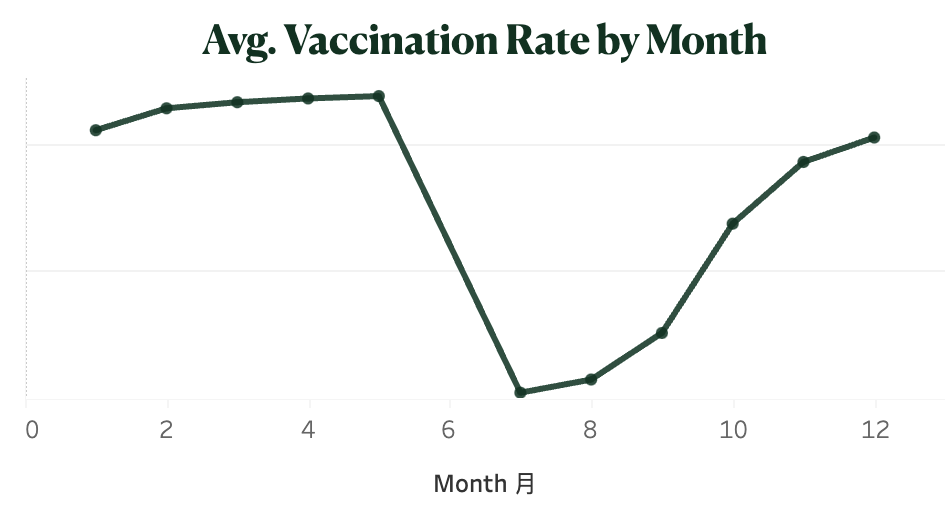

# 💉 Vaccine Victory: Tracking Influenza Coverage
## 🔦 Project Overview
The CDC's dataset of 218K records reveals flu vaccination coverage across the U.S. from 2012 to 2024. This dashboard explores regional, yearly, age group, and monthly trends to uncover how vaccination rates have evolved and which areas are leading in flu prevention efforts. Dive in to see the patterns and insights that shape our understanding of flu vaccination across the country.

Check out my [Tableau Public](https://public.tableau.com/views/vaccinesideproject/InfluenzaVaccinationTrendsandCoverage?:language=zh-TW&:sid=&:redirect=auth&:display_count=n&:origin=viz_share_link)
## 📊 Data Source
### Data Set: 
Centers for Disease Control and Prevention (CDC). Influenza Vaccination Coverage for All Ages (6+ Months). Updated September 25, 2024. Retrieved from https://data.cdc.gov/Flu-Vaccinations/Influenza-Vaccination-Coverage-for-All-Ages-6-Mont/vh55-3he6/about_data

### Data Introduction
- Vaccine: The vaccine type for which estimates are calculated, including the location where vaccination occurred (medical, non-medical, pharmacy, school).
- Geography Type: The classification of geography (HHS Region/National, State/Local Area, County).
- Geography: The specific geography name (e.g., state or county).
- FIPS: The Federal Information Processing Series code, representing state and county codes.
- Season/Survey Year: The influenza season or survey year for which estimates are calculated (county-level data).
- Month: Cumulative vaccination coverage by month for each influenza season.
- Dimension Type: Sociodemographic category for which estimates are calculated (e.g., age group, race/ethnicity).
- Dimension: Specific sociodemographic group (e.g., setting where vaccination occurred: medical, non-medical, pharmacy, school).
- Estimate (%): The estimated vaccination coverage or percentage of persons vaccinated.

## ✨ Key Insights
- Flu Vaccination Trends Over Time & Regions: U.S. flu vaccination rates vary by region, with the Northeastern U.S. (Region 1 and Region 3) leading in coverage due to better healthcare access and public health awareness.
- Age Group Vaccination Trends: Elders (65+) and children (6 months - 17 years) show the highest vaccination rates, while adults at high risk also have elevated uptake, indicating that age and health status are key drivers.
- Peak Years for Protection: Vaccination rates peaked between 2019 and 2021, reflecting a surge in public health awareness during the pandemic, emphasizing the importance of proactive vaccination.
- Seasonal Surge: Month-by-Month Insights: Vaccination rates rise steadily through the flu season, peaking in January, showing a late-season increase in public participation as flu activity intensifies.

      
      

## 🛠️ Setup

## 💻 Technologies
- Excel
- Tableau

## License
This project is licensed under the MIT License.
